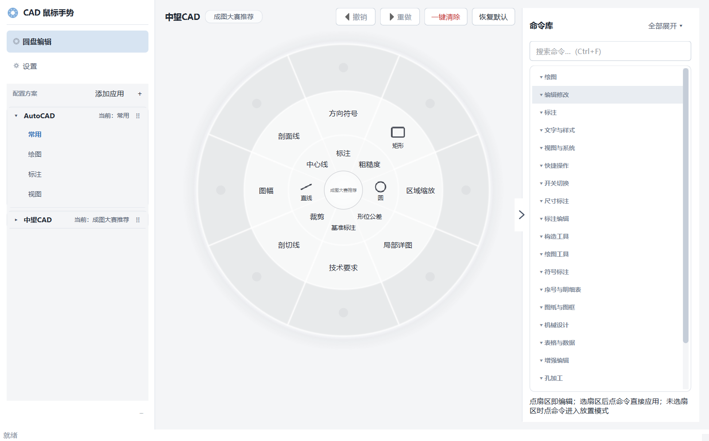

# CAD Gesture

A mouse gesture + radial pie menu tool for **AutoCAD** and **ZWCAD**.
Press and hold the **right mouse button** and drag inside CAD to pick a command from the radial menu and execute it — no need to memorize shortcuts. Built-in preset profiles, ready to use out of the box.

[](https://github.com/Inonvation/cad-gesture/releases)
[](LICENSE)
[](https://github.com/Inonvation/cad-gesture/issues)

[Changelog](CHANGELOG.md) · [License](LICENSE)



## Features

- **Three-ring radial menu**: 8 sectors × 3 rings, with inner / outer / extension rings organizing commands by frequency
- **Smooth gesture interaction**: hold to summon, release to trigger; hover highlight with fade-in animation
- **Multiple profiles**: separate configs for different CAD apps / workflows, auto-switched by foreground window
- **5 menu themes + custom accent**: Graphite / Azure / Emerald / Crimson / Midnight, or pick an accent color to generate the whole palette
- **Modern light/dark config UI** (PySide6/Qt, follows system theme): card-based profile lists, in-place sector editor, command library with search / drag & drop / placement mode, Delete to remove, undo/redo (Ctrl+Z / Ctrl+Y)
- **No interference with CAD operations**: commands are sent via COM `SendCommand`; the hook only listens, never blocks
- **Single instance**: relaunching replaces the old instance
- **One-click update**: check for updates from the tray menu or automatically at startup; downloads the new version and installs it silently

## Requirements

- Windows 10 / 11 (64-bit)
- AutoCAD 2025+ or ZWCAD
- Python 3.11+ (when running from source)

## Quick Start

### Option 1: Packaged build

Two forms are available (config is stored in `%APPDATA%`, so both forms are interchangeable):

| Form | File | Notes |
|------|------|-------|
| Installer (recommended) | `Setup-CADGesture-vX.Y.Z.exe` | Standard install wizard, Start Menu / uninstall entry, supports in-app one-click update |
| Portable | `CADGesture-vX.Y.Z.zip` | No install needed; unzip and run `CADGesture-x64.exe` |

1. Download either form from the latest [Release](https://github.com/Inonvation/cad-gesture/releases)
2. Installer: double-click to run. Portable: unzip the archive first, then run `CADGesture-x64.exe`; the app is ready once the tray icon appears
3. Open CAD, **press and hold the right mouse button and drag** to use

> **SmartScreen warning?** The binaries are unsigned, so Windows may show "Unknown publisher". Click "More info" → "Run anyway" — the app is open source and safe.

### Option 2: Run from source

```powershell
# Install dependencies (Windows)
pip install -r requirements.txt -i https://pypi.tuna.tsinghua.edu.cn/simple

# Run
python main.py
```

## Usage

| Action | Description |
|--------|-------------|
| Open menu | Press and hold the right mouse button and drag inside the CAD window (~80ms) |
| Select command | Drag toward the target sector, release once highlighted |
| Inner ring | High-frequency drawing commands (line, circle, copy, etc.) |
| Outer ring | Editing commands (arc, rotate, scale, etc.) |
| Extension ring | Low-frequency extension commands, triggered past the second ring boundary |
| Tray icon | Right-click → config / check for updates / switch profile / quit |

## Auto Update

- **Check for updates**: tray menu → "Check for updates" queries the latest release immediately; if a new version exists, click "Update now" to download and install it silently
- **Auto-check at startup**: disabled by default (toggle in Settings); when enabled, runs silently in the background at most once per 24 hours
- Updates never touch your config: it lives in `%APPDATA%\CADGesture`, independent of the install directory

## Configuration

Right-click the tray icon → **Config** to open the visual editor:

- **Left**: profiles are grouped into **cards** by app (AutoCAD / ZWCAD / custom apps). Cards are collapsed by default; the header shows the app name and the active profile. Click a header to expand the profile list, drag a header to reorder cards. Use "Add App" to configure gestures for other software
- **Center**: radial menu preview; click a sector to edit its command in place, hover to highlight. The command library is collapsible with search; click to apply to the selected sector, drag & drop or right-click to place onto the disc. Sectors support icons
- **Shortcuts**: `Delete` clears the selected sector, `Ctrl+Z` / `Ctrl+Y` undo / redo, `Ctrl+F` search, `Esc` cancel placement
- **Settings**: UI mode (dark / light / system), theme palette (with custom accent), trigger sensitivity, disc size live preview, auto-start, auto-update

Config is stored in `%APPDATA%\CADGesture\config.json` (Windows standard user directory, independent of the exe location; auto-migrated from the legacy location on first run; template: `config/config.example.json`).

### Config structure

- `profiles`: a dictionary of profiles. Each profile has three rings of commands: `sectors` (inner), `outer_sectors` (outer), `extension_sectors` (extension). Each command is made of `label` (display name), `key` (shortcut / fallback key), `description` (CAD command name) and an optional `icon`
- `target`: the app a profile applies to — built-in `autocad` / `zwcad`, or a custom app id like `app_sldworks`
- `settings` highlights:
  - `app_order`: card display order, e.g. `["autocad", "zwcad", "app_sldworks"]`
  - `custom_targets`: list of custom apps, each with `id`, `name`, `match_exe` (e.g. `sldworks.exe`) and optional `match_title`
  - `autocad_profile` / `zwcad_profile` / `{target}_profile`: the active profile of each app
  - `menu_theme`, `menu_scale`, `menu_opacity`, `ui_mode`, `language`, `hold_threshold_ms`, `trigger_distance`, etc.

Gestures in custom apps use key simulation; COM commands are only used for AutoCAD / ZWCAD.

## FAQ

| Question | Answer |
|----------|--------|
| How do I update? | Tray icon → "Check for updates" (or auto-check at startup), then click "Update now" |
| Will updating lose my config? | No. Config lives in `%APPDATA%\CADGesture`, independent of the install directory |
| Can the portable version update? | Yes — the updater installs it into the user directory and creates an uninstall entry |
| How much memory does it use? | A resident tray app built with Python + Qt; roughly 100~200MB is normal |
| Gestures not working / wrong commands? | See [Troubleshooting](docs/troubleshooting.md): antivirus whitelist, conflicting gesture tools, IME, trigger button conflicts |

## Packaging & Release

```powershell
# Sync version first (5 places: version.txt x4 + src/version.py)
python scriptsset_version.py 0.0.9

# Or just double-click scriptsuild.bat (PyInstaller + Inno Setup)
python -m PyInstaller cad_gesture.spec --clean --noconfirm

# Release artifacts (3 files; the private config/config.json is never packaged):
#   dist/CADGesture-vX.Y.Z.zip          Portable (onedir, zipped)
#   dist/Setup-CADGesture-vX.Y.Z.exe    Installer (Inno Setup 6.3+)
#   config/config.example.json          Config template (Release attachment)
```

## Tech Stack

- **Python 3.11+** / Win32 API (low-level mouse hook `WH_MOUSE_LL`, Per-Monitor V2 DPI awareness)
- **PySide6 / Qt 6** (GUI: system tray, transparent radial menu, config UI)
- **COM / pyautogui** (command execution)
- **PyInstaller** (packaging)

## Project Structure

```
main.py                  # Entry point (single-instance check + DPI awareness)
requirements.txt         # Dependencies
cad_gesture.iss          # Inno Setup script (builds Setup-CADGesture-vX.Y.Z.exe)
config/                  # Config (auto-generated on first run; template: config.example.json)
src/                     # Source code
├── app.py               # Main app: event queue, tray, config entry, update flow
├── gesture_engine.py    # Mouse hook, gesture / ring detection
├── qt_radial_menu.py    # Qt transparent overlay radial menu
├── qt_renderer.py       # Shared Qt disc drawing (runtime + config preview)
├── command_executor.py  # COM command execution + fallback
├── qt_config_gui.py     # Qt config UI
├── theme.py             # UI colors + 5 disc appearance themes + custom accent
├── updater.py           # Auto update (check / download / silent install)
├── version.py           # Runtime version (kept in sync with version.txt)
└── ...                  # Config manager, presets, logging, single-instance, etc.
scripts/                 # Dev scripts (build.bat, verify, set_version, icon generator)
assets/                  # App icon
tests/                   # Unit tests
```

This project is **independently developed**. Inspired by the mouse gestures in Quicker and SolidWorks, it is a first attempt at building a Python desktop app with AI assistance. Built in spare time with limited resources, so issues and PRs are welcome. Thanks for using it!
